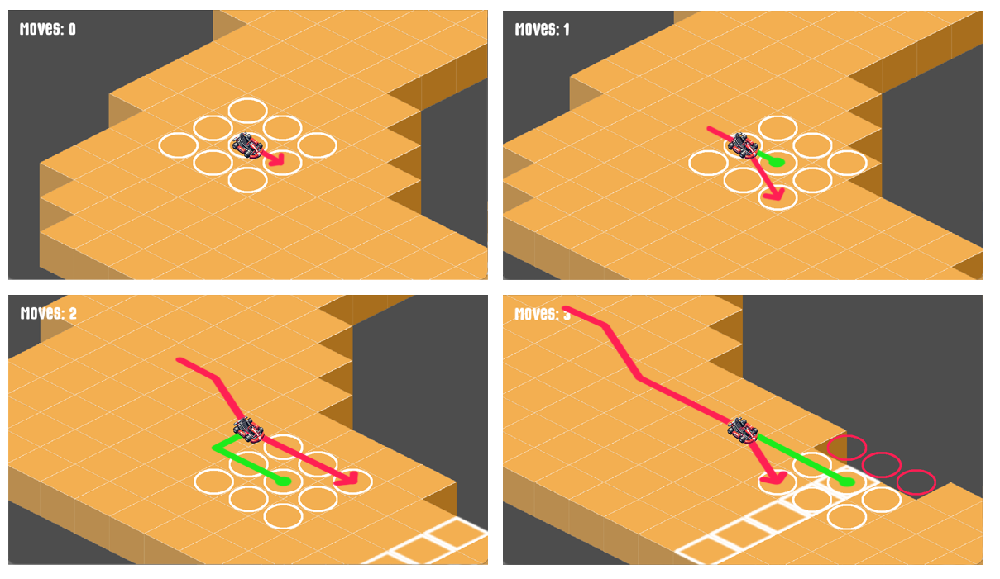

## **A Different Kind of Racing Game**

I know that **turn-based racing** might sound strange at first. But this game **isn’t about speed or reflexes**—instead, it’s about **planning, precision, and strategy**. Your ability to **control acceleration and trajectory** depends entirely on **previous moves**, requiring forward-thinking and adaptability.

<!--more-->

## **The Basics: Movement & Turns**

- The game is **grid-based**, with each car occupying a single cell.  
- A move starts by **copying the previous move** from the car’s current position—this defines the **reference cell** for the next move.  
- The player can then **choose the reference cell or any adjacent cell**, as long as it’s available.  
- A cell is available if it’s **on the track and not occupied** by another racer.

This simple system creates **a deep, tactical challenge**, where players must anticipate their trajectory **several turns in advance**.

## **Expanding the Mechanics: Strategy Beyond the Basics**

The foundation of *Vector Shift* is simple, but strategic depth comes from **track design and additional gameplay elements**.

### **1. Racing Disciplines: Adjusting the Rules of Motion**

Different racing formats demand different driving styles, so the game will modify **movement mechanics** accordingly:  

- **Formula 1: High-Speed Precision**  
  - F1 cars are built for **speed and maintaining the racing line**.  
  - In F1 races, **the reference cell’s movement options expand by two cells forward instead of one**, but only in the direction of travel.  
  - This means **higher acceleration and braking**, but **less flexibility for sharp turns**.  

- **Rally & GT Racing: Specialized Mechanics**  
  - Similar tweaks will be implemented to ensure **Rally and GT racing** reflect their unique characteristics, requiring different strategies to master.  

### **2. Wild Card Cells & Power-Ups: Dynamic Track Elements**

The **grid-based system** allows for interactive track elements that affect decision-making:

- **Wild Card Cells**  
  - Special tiles that **modify the next move**, such as:  
    - **Speed boosts** (temporary acceleration increase).  
    - **Slippery patches** (momentum carries farther than expected).  
    - **Restricted movement** (forcing a limited choice next turn).  

- **Power-Ups**  
  - Players can **collect and use power-ups strategically**, including:  
    - **Turbo Boost** – Temporary speed increase.  
    - **Grip Enhancement** – Better control in turns.  
    - **Slipstream Effect** – Extra acceleration when trailing an opponent.  

### **3. Car Upgrades & Skills: Customizing Your Driving Style**

Winning races should feel rewarding, so players will be able to **upgrade their car and develop unique driving styles**:

- **Customizable Driving Styles**  
  - Players can **enhance specific attributes** at the cost of others, such as:  
    - **Control Specialist** – Improved lateral movement but reduced acceleration.  
    - **Speed Demon** – Greater forward acceleration but weaker braking and turning.  
    - **Balanced Driver** – A steady mix of all attributes.  

- **Upgrade System**  
  - Players can earn **permanent improvements** by winning races, such as:  
    - Better acceleration and braking.  
    - Improved handling on certain track types.  
    - Resistance to track hazards.  

These mechanics add **long-term progression**, ensuring **player choices matter**.

## **What’s Next**

You might have noticed that this blog is missing something important: **graphics**. That’s because I haven’t yet decided on the game’s **visual style**. I have a few ideas in mind, and I’ll explore them in a future post.

In the meantime, I’m already working on **prototyping the gameplay**, refining the core mechanics to ensure they feel engaging and intuitive.

As for my next post, I haven’t settled on which aspect to cover first—so stay tuned! 🚀
